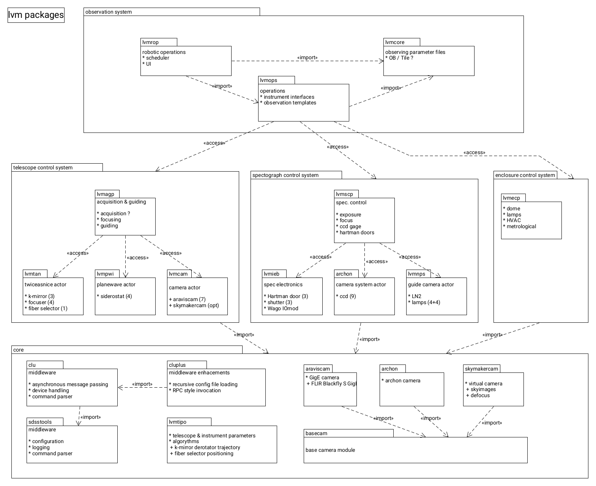

# lvm superproject v0.0.40

## Notes
### clone with all lvm packages

    git clone --recurse-submodules -j8 --remote-submodules https://github.com/sdss/lvm.git
    
For already cloned repos, or older Git versions, use:

    git clone https://github.com/sdss/lvm.git
    cd lvm
    git submodule update --init --recursive --remote
    
### update 

    git submodule update --remote
    

